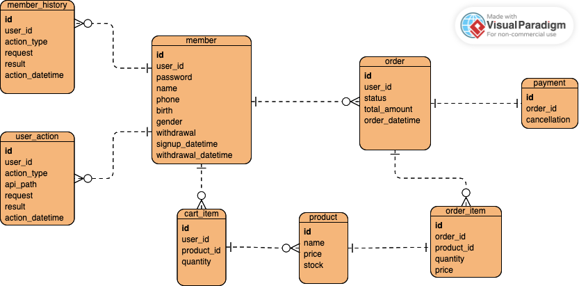
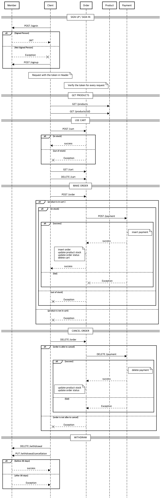

# mobile-order

## 개발 환경
- Java 17
- SpringBoot 3.3.0
- Gradle 8.7
- JUnit 5


## 실행
### 다운로드
- [mobile-order-0.0.1.jar](https://github.com/ihaeeun/mobile_order/raw/main/mobile-order-0.0.1.jar)  

### 실행 방법
```shell
$ java -jar mobile-order-0.0.1.jar
```

###  Host
localhost:8000

<br>

## API Spec  
API 명세는 [API.md](https://github.com/ihaeeun/mobile_order/blob/main/doc/API.md)에 있습니다.

<br>

## Database
- ERD  
  
- 스키마 및 인덱스는 [schema.sql](https://github.com/ihaeeun/mobile_order/tree/main/src/main/resources/schema.sql)을 참조해 주세요.

<br>

## Sequence Diagram



## 구현 사항  
- 현재는 하나의 프로젝트에서 모든 서비스를 제공하지만, 추후 모듈로 분리하기 용이하도록 패키지를 다음과 같이 분리했습니다.

  | directory | role |
  |----|--------|    
  | common    | 공통 라이브러리 |  
  | member    | 회원 |   
  | order     | 주문 |   
  | payment   | 결제 |   
  | product   | 상품 |

### Member
- 로그인 후 JWT 발급하고, 해당 토큰을 사용하면 사용자 인증이 되었다고 간주합니다.
- 토큰은 Header에 추가하여 사용하고, 서버에서는 해당 UserContextResolver에서 토큰을 UserContext로 변환하여 사용합니다.


### Product
- 애플리케이션 실행 시 다음 데이터들이 추가됩니다.
  ```json
  [
      {
          "id": 1,
          "name": "americano",
          "price": 5000,
          "stock": 200
      },
      {
          "id": 2,
          "name": "cafe latte",
          "price": 6000,
          "stock": 100
      },
      {
          "id": 3,
          "name": "ice tea",
          "price": 3000,
          "stock": 50
      },
      {
          "id": 4,
          "name": "black tea",
          "price": 4000,
          "stock": 20
      },
      {
          "id": 5,
          "name": "toast",
          "price": 5000,
          "stock": 5
      }
  ]
  ```
### Order
- 주문은 카트에 담긴 항목들에 대해서만 주문이 가능합니다.
- 주문 목록에 재고가 없는 상품이 포함되어 있으면 주문이 불가능합니다.
- 주문 및 결제 성공 / 주문 취소 및 결제 취소 성공 시 상품의 재고가 업데이트 됩니다.

### Payment
- 결제 성공 및 실패 응답을 랜덤하게 돌려줍니다.

### 기타
- UserAction과 MemberHistory는 AOP로 구현되어 로깅이 필요한 메소드에는 `@UserAction` 및 `@MemberHistory` 어노테이션을 사용했습니다.


## 개선 필요 사항
- 재고 업데이트 시 **동시성 관리** 필요
  - JPA Optimistic Lock 적용
  - 분산 락 적용
- Request validation

